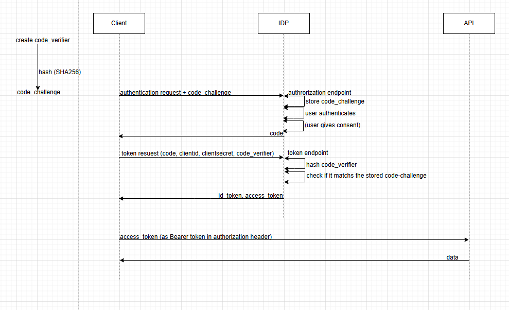

# OpenIdConnectDemo

This is a demo project to show how to use OpenIdConnect with Duende IdentityServer and ASP.NET Core and Angular.

## How to run the confidential client
	1. Run the IDP
	2. Run the Api
	3. Run the ASP.NET Core client

## How to run the public client
	1. Run the IDP
	2. Run the Api
	3. Run the angular client

## Authorization Code flow with PKCE

